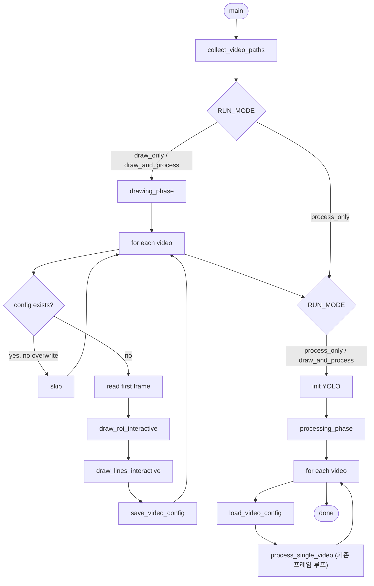

## 목표

1. **라인 드로잉 모드 추가** — 지금은 `LINE_INFO_PATH`의 JSON에만 의존. ROI의 `draw`/`file`처럼 라인도 인터랙티브 그리기를 지원. id는 그리는 순서대로 0,1,2,... 자동 부여.
2. **멀티 영상 워크플로우** — `input/` 안의 AVI 7개처럼 여러 영상에 대해 "먼저 전부 그리기 → 이후 일괄 처리" 순서로 진행. 각 영상의 라인+ROI는 `configs/{video_stem}.json` 하나에 묶어 저장/재사용.

## 주요 변경 지점

### 1) 전역 설정 재구성 ([L31-60](z_test/visualize/visualize_counting.py) 근처)

- `VIDEO_PATH` → `VIDEO_PATHS: list[str] | None` + `VIDEO_DIR: str | None` + `VIDEO_GLOB: str`
  - `VIDEO_PATHS`가 설정되어 있으면 그 리스트 사용, 아니면 `VIDEO_DIR`에서 `VIDEO_GLOB`로 수집
  - 단일 영상은 길이 1 리스트로 처리 (하위 호환)
- 신규 `LINE_MODE: "file" | "draw"` — `LINE_INFO_PATH`는 `LINE_MODE="file"`에서만 사용
- 신규 `RUN_MODE: "draw_only" | "process_only" | "draw_and_process"` — 기본은 `draw_and_process`
- 신규 `CONFIG_DIR = "z_test/visualize/configs"` — per-video 통합 JSON 저장 위치
- 신규 `OVERWRITE_EXISTING_CONFIG: bool` — 이미 있는 config 재사용 여부
- `LANE_MAP`은 유지(0이 기준선, 1~4가 차선) — 사용자가 그리는 순서대로 0부터 부여되므로 안내 문구에 "첫 번째 라인이 기준선(id=0), 이후가 각 차선" 명시

### 2) 라인 드로잉 함수 신설

`draw_lines_interactive(frame, roi_polygon=None) -> list[dict]` 를 [`draw_roi_interactive` L148](z_test/visualize/visualize_counting.py) 바로 아래에 추가.

- 조작법 (ROI 드로잉과 시각적으로 일관성 유지):
  - 좌클릭 1회: 시작점, 좌클릭 2회: 끝점 → 한 선분 완성 시 자동으로 `polylines_lst`에 추가, id는 현재 길이
  - 우클릭: 마지막으로 완성된 선분 Undo (임시 시작점이 있으면 시작점만 취소)
  - Enter/Space: 확정 및 종료 (최소 2개 이상일 때만)
  - R: 전체 초기화
  - ESC: 취소 (파일 모드로 폴백 또는 건너뛰기)
- 배경에 ROI 폴리곤(반투명)을 참조 표시하여 라인을 ROI와 맞춰 그릴 수 있게 함
- 각 라인에 id 라벨(0,1,2...)을 그 중점에 표시, 팔레트는 `PALETTE_BGR`에서 순환

반환 포맷은 `line_info.txt`의 `polylines_lst`와 동일:

```python
[{"id": 0, "num_lines": 1, "coords": [[x1, y1, x2, y2]]}, ...]
```

### 3) Per-video 통합 config 입출력

신규 함수 2개를 [`save_roi_polygon`/`load_roi_polygon` L266-278](z_test/visualize/visualize_counting.py) 근처에 추가:

- `save_video_config(path, canvas_size, polylines_lst, roi_polygon)` — 아래 포맷으로 저장

```json
{
  "canvas_size": "1920x1080",
  "polylines_lst": [ ... ],
  "roi_polygon": [[x, y], ...]
}
```

- `load_video_config(path) -> dict` — 위 파일 로드, 없으면 `None`

기존 `load_and_scale_lines`는 파일 경로가 아닌 **dict를 받도록** 시그니처를 분기하거나, `scale_lines(polylines_lst, src_wh, dst_wh)` 보조 함수를 추가해 공통화.

### 4) `main()` 을 두 페이즈로 분리

현재 [`main()` L998-1254](z_test/visualize/visualize_counting.py)를 아래처럼 재구성:

```python
def collect_video_paths() -> list[Path]: ...

def drawing_phase(video_paths):
    """각 영상의 첫 프레임을 열어 ROI+라인을 그리고 config 저장"""
    for vp in video_paths:
        cfg_path = Path(CONFIG_DIR) / f"{vp.stem}.json"
        if cfg_path.exists() and not OVERWRITE_EXISTING_CONFIG:
            print(f"  [skip] {vp.name} (config exists)")
            continue
        first_frame, (w, h) = read_first_frame(vp)
        roi = draw_roi_interactive(first_frame) if ROI_ENABLED and ROI_MODE == "draw" else ...
        lines = draw_lines_interactive(first_frame, roi_polygon=roi) if LINE_MODE == "draw" else load_from_line_info()
        save_video_config(cfg_path, f"{w}x{h}", lines, roi)

def processing_phase(video_paths, model, tracker_factory):
    for vp in video_paths:
        cfg = load_video_config(Path(CONFIG_DIR) / f"{vp.stem}.json")
        process_single_video(vp, cfg, model, tracker_factory)

def process_single_video(video_path, config, model, tracker_factory):
    """기존 main()의 프레임 루프 + writer + ffmpeg + 결과 요약을 이 함수로 이동"""
    ...

def main():
    os.makedirs(OUTPUT_DIR, exist_ok=True)
    os.makedirs(CONFIG_DIR, exist_ok=True)
    video_paths = collect_video_paths()
    if RUN_MODE in ("draw_only", "draw_and_process"):
        drawing_phase(video_paths)
    if RUN_MODE in ("process_only", "draw_and_process"):
        model, tracker_factory = init_model_and_tracker()
        processing_phase(video_paths, model, tracker_factory)
```

핵심 포인트:
- YOLO 모델은 1회만 로드해 재사용, BoTSORT는 영상마다 새 인스턴스 (상태 초기화 필요) — `tracker_factory()` 팩토리로 감쌈
- 출력 파일명을 `counting_result_{video_stem}_{timestamp}.mp4`로 변경
- 성능 요약과 카운팅 결과 요약은 영상별로 출력, 마지막에 전체 총합 요약 추가

### 5) 워크플로우 다이어그램



### 6) 기존 동작 호환성

- `VIDEO_PATHS=None, VIDEO_DIR=None`, `LINE_MODE="file"`, `RUN_MODE="draw_and_process"` 조합을 기본값으로 두면 사실상 기존 단일영상 사용자의 흐름과 거의 동일 (단, ROI/Line 모두 config로 저장되어 재실행 시 재사용)
- `LINE_INFO_PATH`는 `LINE_MODE="file"`일 때만 읽음, 없으면 그 영상은 건너뛰고 경고
- 기존 `save_roi_polygon`/`load_roi_polygon`는 유지 (독립 ROI json은 backward compat 용으로 두고, 새 워크플로우는 통합 config로만 저장)

## 테스트 방법

1. 단일 영상 기본 동작 확인: `VIDEO_PATHS=["z_test/visualize/input/sample.mp4"]`, `LINE_MODE="file"` → 기존 line_info.txt 로드되어 동작
2. 라인 그리기: 같은 영상에 `LINE_MODE="draw"`, `ROI_MODE="draw"` → 두 번 연속 그리기 창이 뜨고 `configs/sample.json` 저장, 결과 영상 생성
3. 멀티 영상: `VIDEO_DIR="z_test/visualize/input"`, `VIDEO_GLOB="*.avi"`, `RUN_MODE="draw_and_process"` → 7개 영상 순차적으로 ROI+Line 그리기 창 → 이후 배치 처리
4. 중단 후 재개: `RUN_MODE="draw_only"`로 그리기만 완료 → `RUN_MODE="process_only"`로 배치 실행 → 그리기 단계 스킵 확인